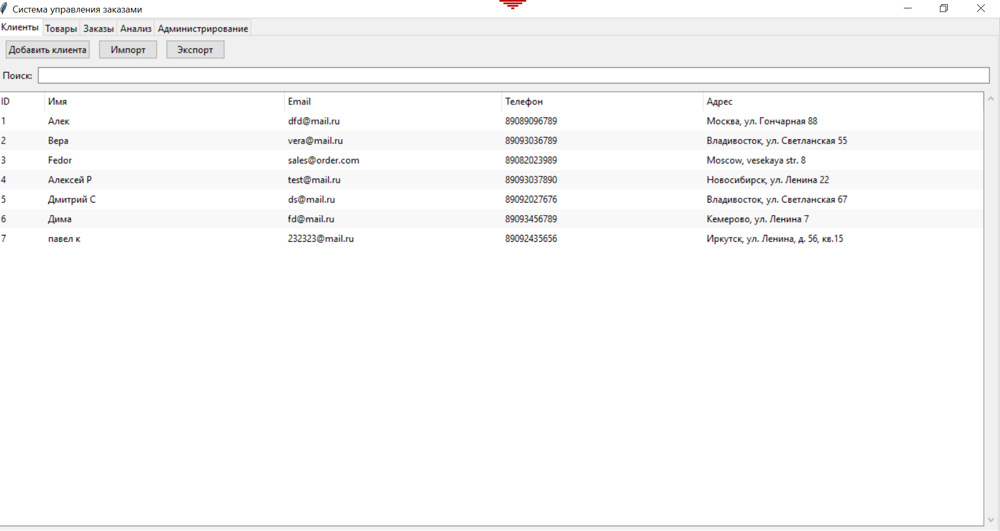
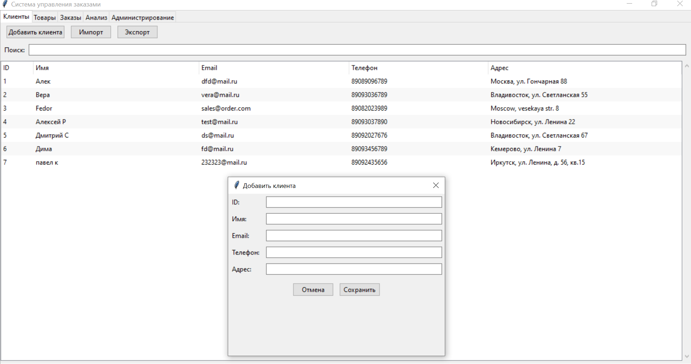
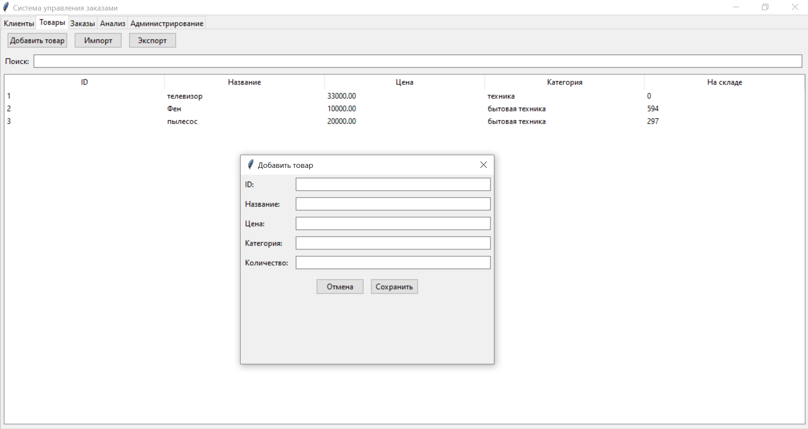
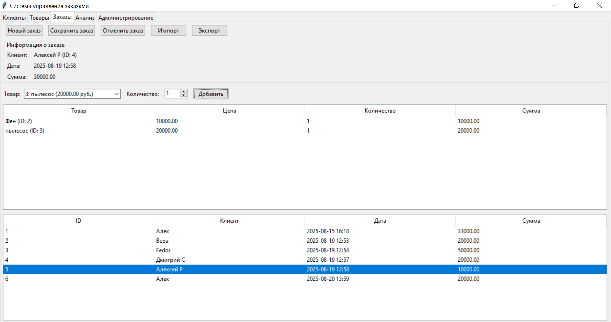
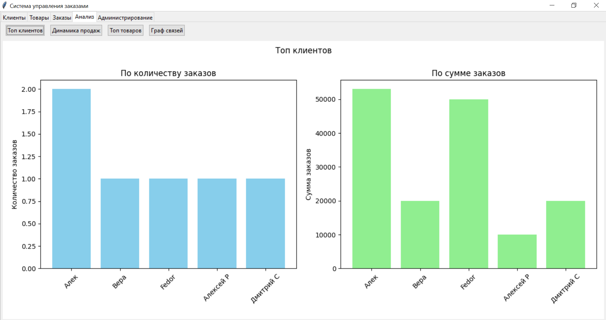
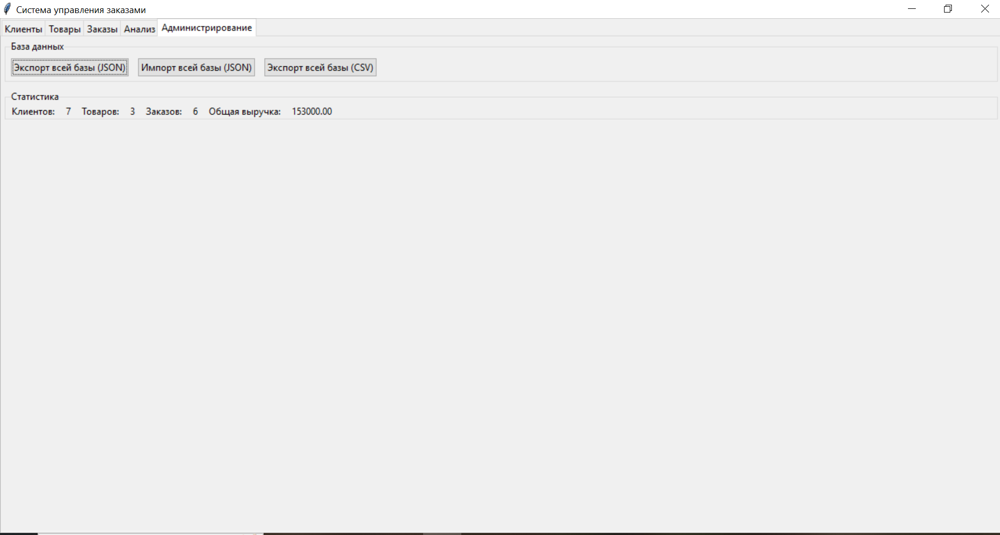

# Order Management System

Система управления заказами (OMS) с графическим интерфейсом на Python.

## Функциональность

- Управление клиентами, товарами и заказами
- Аналитика и визуализация данных
- Импорт/экспорт данных (JSON, CSV)
- Графический интерфейс на tkinter

## Установка

1. Клонируйте репозиторий:

git clone https://github.com/alexeyromanenko125-prog/order-management-system.git
cd order-management-system

2. Установите зависимости:

pip install -r requirements.txt

3. Запустите приложение:

python main.py

## Тестирование

### Запуск тестов

# Все тесты
python -m unittest discover

# Конкретный модуль
python -m unittest test_models.py
python -m unittest test_analysis.py

## 📸 Скриншоты программы

### Управление клиентами

*Окно управления базой клиентов*

### Добавление клиентов

*Окно управления базой клиентов*

### Управление товарами

*Окно управления базой товаров*

### Создание заказов

*Форма создания и редактирования заказов*

### Аналитика продаж

*Графики и отчеты по анализу продаж*

### Администрирование продаж

*Экспорт/импорт данных, общая статистика*